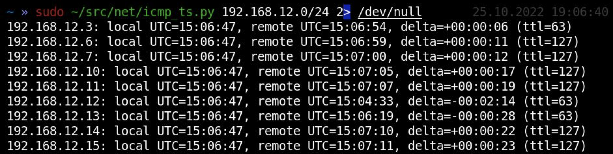

# Практические нюансы и подходы

## Public

Основная информация из тг-каналов (даже скриншоты брать буду, фу)

* [https://t.me/s0i37\_channel](https://t.me/s0i37\_channel)
* [https://t.me/in6uz](https://t.me/in6uz)

## Notes & Tricks

### TCP Uptimes

Источник: [https://t.me/s0i37\_channel/53](https://t.me/s0i37\_channel/53)

Enumeration is the key. Мало кто знает сколько информации можно взять из самых простых вещей. В частности почти всегда по TCP с любого открытого порта мы можем узнать uptime машины.

<figure><figcaption></figcaption></figure>

Это крайне полезная информация которая позволяет понять что те или иные ip это всего лишь один хост (alias, dual-home). Или наоборот что тот или иной ip это например сразу три машины.

<figure><figcaption></figcaption></figure>

Иногда uptime постоянно меняется. Это следствие наличия балансировочных серверов. Сгруппировав все собранные uptime мы можем узнать количество серверов обслуживающих высоконагруженную систему.

Определять uptime мы можем hping3, metasploit, p0f, моими scapy-скриптами ([https://github.com/s0i37/net/blob/main/tcp\_analyze.py](https://github.com/s0i37/net/blob/main/tcp\_analyze.py)) или моим nse-скриптом для nmap ([https://github.com/nmap/nmap/pull/2249/commits/d92c5629fde04c73b7bd63a97aff813ccc1bedac](https://github.com/nmap/nmap/pull/2249/commits/d92c5629fde04c73b7bd63a97aff813ccc1bedac)), который на несколько лет застрял в pull requests. Помимо протокола IP, получить uptime можно по SMB (FindSMB2UPTime.py).

### IP Options

Источник: [https://t.me/s0i37\_channel/57](https://t.me/s0i37\_channel/57)

В каждом IP пакете есть особое хитрое поле options. С помощью специальной опции Record Route мы можем заставить сетевое оборудование логировать в пакет все сетевые интерфейсы по которым идём пакет, включая входящие и исходящие интерфейсы. Такая информация будет более полная нежели обычный traceroute.

<figure><figcaption></figcaption></figure>

Тоже самое можем сделать и с помощью nmap:&#x20;

<figure><figcaption></figcaption></figure>

Для любителей самостоятельно крафтить пакеты хороший пример https://github.com/s0i37/net/blob/main/rr\_test.py

### ARP: когда сервер не пингуется, но он есть

Link: [https://t.me/s0i37\_channel/51](https://t.me/s0i37\_channel/51)

Очень простой трюк как с помощью ARP можно обнаруживать скрытые узлы. Думаете если нет пинга то устройство отсутствует? Проверьте ARP-кэш. Если хоста реально нет в сети, то его MAC-адрес вам ни кто другой не сообщит.

<figure><figcaption></figcaption></figure>

Простой scapy-скрипт ([https://github.com/s0i37/net/blob/main/arp\_scan.py](https://github.com/s0i37/net/blob/main/arp\_scan.py)) позволит автоматизировать данный нехитрый процесс.

### ICMP: получаем время на сервере

Link: [https://t.me/s0i37\_channel/49](https://t.me/s0i37\_channel/49)

У протокола ICMP (ping) есть один хитрый запрос, который позволяет получить время на удаленной машине. Видно что originate и transmit отличаются. Первое это ход ваших часов, второе часы на удаленном сервере в формате миллисекунд от 00:00 UTC. Разница между ними соответственно различие между вашими часами.

<figure><figcaption></figcaption></figure>

С Windows как всегда нюанс, она передает метку времени в big endian. Еще один мой scapy-скрипт (https://github.com/s0i37/net/blob/main/icmp\_ts.py) умеет исправлять это и выводить время на куче серверов сразу.

### ICMP TTL

Link: [https://t.me/s0i37\_channel/26](https://t.me/s0i37\_channel/26)

С 99% мы можем определить ОС удалённого хоста. Всего существует 4 популярных начальных значения ttl: 32,64,128, 255, которые начинают убывать по мере отдаления от хоста (т.н. хопы).

<figure><figcaption></figcaption></figure>

Крайне редко мне встречались Windows с ttl=64 и совсем редко специфичные железки с ttl=32. Более подробно ОС можно вычислить уже по TCP (см p0f).
