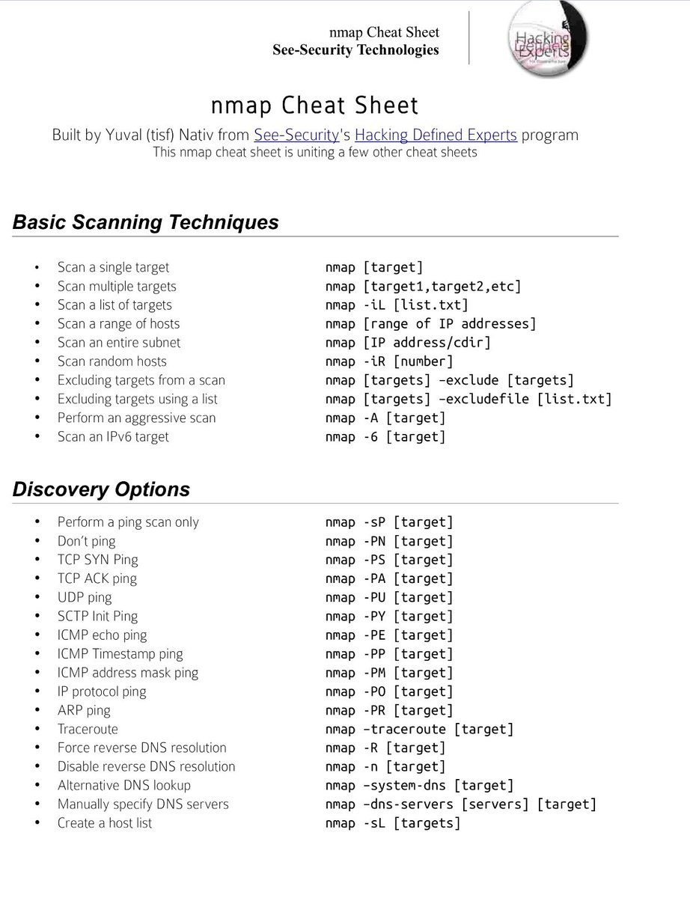

# nmap



```
Небольшая подборочка моих запасенных команд для Nmap "на все случаи жизни".
Regular:
nmap -R -Pn -sC -sV --version-all -T5 -p- --open -v -oN %y%m%d-target-name <target>

Fast Full Host Discovery:
nmap --min-rate=400 --min-parallelism=512 -p22,445,3389,80,443 -Pn -R -PS -oA %y%m%d-Full <target>

Check HTTP Methods
nmap --script=http-methods <target> -n -p 80

HTTP Base Auth Brute:
nmap --script http-brute -p 80 --script-args="[http-brute.hostname=<target>],http-brute.method=GET,http-brute.path=[/path],brute.firstonly=true,userdb=[Users.txt],passdb=[Passwords.txt]" -v --system-dns <target>

HTTP Auth Form Brute:
nmap --script http-form-brute -p 80 --script-args="[brute.firstonly=true],http-form-brute.path=[/path],http-form-brute.onfailure='Error message.',http-form-brute.passvar=[password],http-form-brute.uservar=[username],http-form-brute.method=POST,[brute.emptypass=true]" <target>

POP3 Brute:
nmap -sV --script=pop3-brute --script-args='passdb=[file_with_pass],userdb=[file_with_names],brute.emptypass[,brute.firstonly][,brute.threads]' <target>

SMB Checks:
nmap -p 139,445 --script smb-os-discovery,smb-enum-shares,smb-system-info,smb-security-mode <target> #smb-vuln-ms17-010
Проверка на вулны: nmap --script smb-vuln* -p 445 192.168.1.101

SSH Brute:
nmap -p 22 --script ssh-brute --script-args user=root,passdb=pass.lst --script-args ssh-brute.timeout=4s <target>

LDAP Search:
nmap –script ldap-search –T4 –o nmap.ldap_search <target>

SNMP Scan:
nmap -P0 -v -sU -p 161 -oA snmp_scan <target>
```

Есть скрипт `vulners.nse`

\-Pn - считать хосты как онлайн (пропуск этапа host discovery)

```
Примеры:
nmap -v -sn 192.168.1.0/24 - сканируем сеть. Порты не покажет (или плохо), зато узнаем узлы конечные.
-sP - то же сканирование сети (пинг)
-sV - попробовать узнать версии ПО на портах
-n/-R - не использовать/использовать DNS-resolve

-sC == --script=default
       --script=<group nse scripts: safe, vuln, etc>
-sV - OS/Version detection
-oA - out to file
Example: nmap -sC -sV -oA nmap/myservice 192.168.1.1
```

Бинарь можно взять отсюда: [https://github.com/andrew-d/static-binaries/tree/master/binaries/windows/x86](https://github.com/andrew-d/static-binaries/tree/master/binaries/windows/x86)

## Билд для быстрого сканирования подсети

Отсюда взято: [https://t.me/webpwn/306](https://t.me/webpwn/306)

Из-за количества хостов сканирование будет длиться сутки, неделю или больше, а с данными хочется работать в ближайшее время.

Одно из решений - это использовать многоходовочку, поделить сканирование на несколько шагов и быстро получить данные самых популярных портов, пока редкие порты сканируются.

Играемся с таймаутом RTT, таймаутом хостов ([tarpit](https://en.wikipedia.org/wiki/Tarpit\_\(networking\)) еще никто не отменял), количеством попыток на ответ и другие настройки.

Но если нам нужно увеличить точность, то запускаем с `-Pn`, если скорость, то без него.&#x20;

Кстати, nmap умеет импортировать данные предыдущего сканирования и работать уже с ним, например, `nmap --script-args newtargets,state=up,iX=scan.xml`&#x20;

запустит сканирование взяв в качестве целей для сканирования хосты из файла scan.xml, которые находились в статусе up в тот момент.&#x20;

_Важно, что если у хоста не будет открытых портов из топа, то он не попадет в выдачу первого шага, и втором и третьем шаге его попросту не будет._

Ставим как исходящий порт - 53 (DNS), чтобы обмануть некоторые наркоманские настройки фаерволов, получаем подобный [скрипт](https://gist.github.com/Bo0oM/f4cbd111df7da00b51d94cee2b395e7f):

```bash
echo -n "Target list (google.com, 192.168.1.1/24): "
read IP

echo "Treat all hosts as online -- skip host discovery (Y/N)?"
read answer
PN=""
if [ "$answer" != "${answer#[Yy]}" ] ; then
    PN="-Pn";
fi

nmap $IP $PN --privileged --min-rtt-timeout 50ms --initial-rtt-timeout 300ms --max-retries 2 --host-timeout 15m -g 53 -p T:80,443,25,135,137,139,445,1433,3306,5432,23,21,22,110,111,2049,3389,8080 -sV -sC -oX step1.xml && nmap --privileged --min-hostgroup 100 --max-hostgroup 1000 --max-rtt-timeout 500ms --min-rtt-timeout 50ms --initial-rtt-timeout 300ms --max-retries 2 -g 53 -p T:0-20,24,26-79,81-109,112-134,136,138,140-442,444,446-1432,1434-2048,2050-3305,3307-3388,3390-5431,5433-8079,8081-29999,U:53,111,137,161,162,500,1434,5060,11211 -sV -sC -oX step2.xml --script targets-xml --script-args newtargets,state=up,iX=step1.xml&& nmap --privileged --min-hostgroup 100 --max-hostgroup 1000 --max-rtt-timeout 500ms --min-rtt-timeout 50ms --initial-rtt-timeout 300ms --max-retries 2 -sV -g 53 -p T:30000-65535,U:67-69,123,135,138,139,445,514,520,631,1434,1900,4500,5353,49152 -oX step3.xml --script targets-xml --script-args newtargets,state=up,iX=step2.xml
```

Во время сканирования забираем полученные XML файлы, загружаем в нужный нам софт.

В других случаях используем [Masscan](https://github.com/robertdavidgraham/masscan) и [RustScan](https://github.com/RustScan/RustScan).

