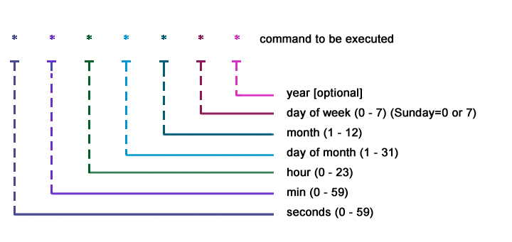

# Background Services and Crons

Source: [https://abarrak.gitbook.io/linux-sysops-handbook/](https://abarrak.gitbook.io/linux-sysops-handbook/)

To list the available categories of daemons, run:

```
$ systemctl -t help
```

There are 3 types of daemons: 1. services, 2. sockets, 3. paths. Use the following to see the system's processes in each:

```
$ systemctl
$ systemctl list-units --type=service
$ systemctl list-units --type=socket --state=LOAD
$ systemctl list-units --type=path --all
$ systemctl list-unit-files
```

To view the status of a daemon use the `status` command or its state shortcuts:

```
$ systemctl status kubelet
$ systemctl is-active dockerd
$ systemctl is-enabled sshd.service
```

Additionally, use the following to list a daemon dependencies:

```
$ systemctl list-dependencies nginx.service
```

The cron daemon `crond` is responsible for managing the user's and system's scheduled jobs. Use the command `crontab` to manage jobs and their files in the user account or in the system wide `/etc/crontab`, `/etc/cron.d/` locations.

```
$ sudo crontab -l
$ sudo crontab -e
$ vim /etc/cron.d/my-backup
```

The syntax of crontab entries is captured by the diagram below. Use the [https://crontab.guru/](https://crontab.guru/)



An example of a cron entry that runs backup command, every day at 5:00 AM:

```
0 5 * * * /usr/bin/daily-backup
```
